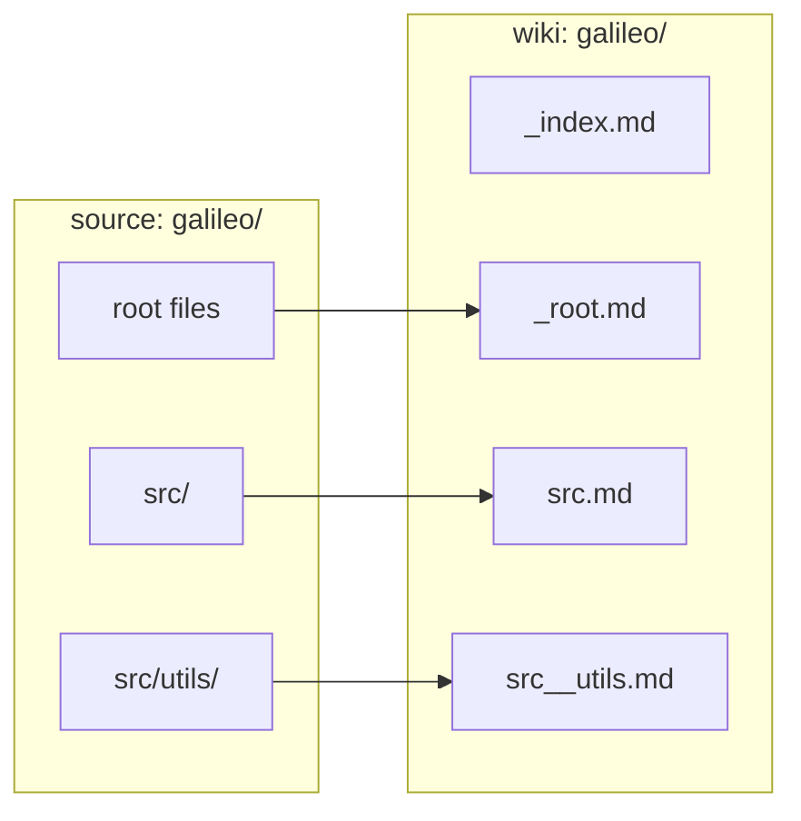
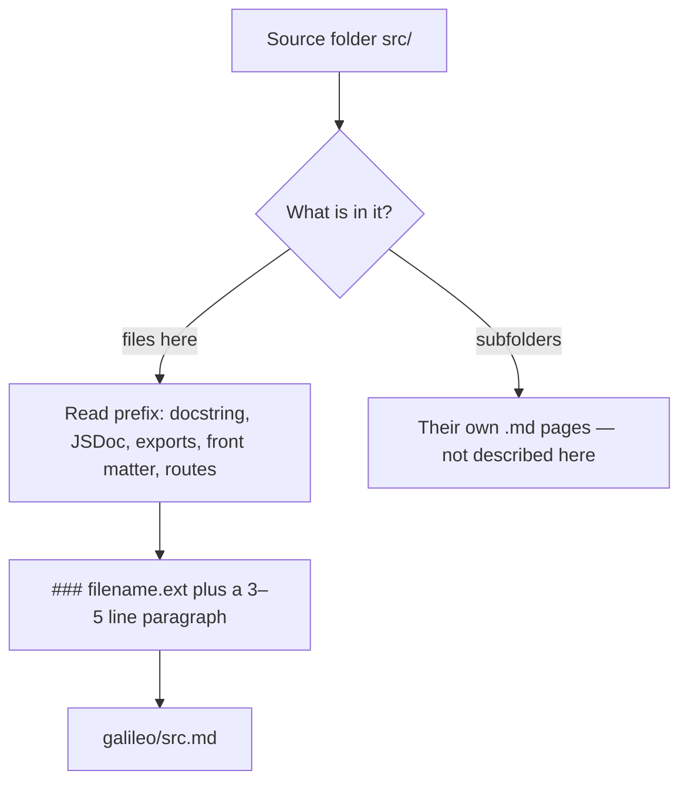
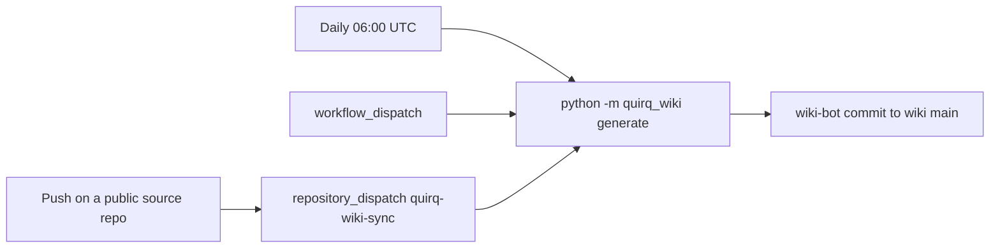

# quirq-ai org wiki

A map of **what lives where** across every public repository in [`quirq-ai`](https://github.com/quirq-ai).

Each public repo gets a folder here. Each source directory gets one markdown page. File-level pages are generated — edit the generator or this README, not those pages. This `wiki` repo is not documented as content (no `wiki/` folder).

[Index](INDEX.md) · [Activity](_activity/INDEX.md) · [generator](quirq_wiki/) · [sync workflow](.github/workflows/wiki-sync.yml)

## Repos

Public only. Forks included. Archived skipped. Private never listed. Discovery is `GET /orgs/quirq-ai/repos?type=all`, not the search API.

```mermaid
flowchart LR
  subgraph public["quirq-ai · public"]
    direction LR
    github[".github"]
    agent_skills["agent-skills"]
    depot["depot"]
    docs["docs *"]
    environment["environment"]
    euler["euler"]
    galileo["galileo"]
    gardener["gardener"]
    gate["gate"]
    infra_config["infra-config"]
    innernet["innernet"]
    installer["installer"]
    instants["instants"]
    marketing["marketing"]
    monitoring["monitoring"]
    perf["perf"]
    quirq_ai["quirq_ai"]
    quirqy["quirqy"]
    quitter["quitter"]
    recipes["recipes"]
    release["release"]
    remote_build["remote-build"]
    research["research"]
    rollers["rollers"]
    setup["setup"]
    sync["sync"]
    test_pipelines["test-pipelines"]
    toolchains["toolchains"]
    ui["ui"]
    website["website"]
    xo_cowork_api["xo-cowork-api"]
    xo_space["xo-space *"]
  end
  click github "./.github/_index.md"
  click agent_skills "./agent-skills/_index.md"
  click depot "./depot/_index.md"
  click docs "./docs/_index.md"
  click environment "./environment/_index.md"
  click euler "./euler/_index.md"
  click galileo "./galileo/_index.md"
  click gardener "./gardener/_index.md"
  click gate "./gate/_index.md"
  click infra_config "./infra-config/_index.md"
  click innernet "./innernet/_index.md"
  click installer "./installer/_index.md"
  click instants "./instants/_index.md"
  click marketing "./marketing/_index.md"
  click monitoring "./monitoring/_index.md"
  click perf "./perf/_index.md"
  click quirq_ai "./quirq_ai/_index.md"
  click quirqy "./quirqy/_index.md"
  click quitter "./quitter/_index.md"
  click recipes "./recipes/_index.md"
  click release "./release/_index.md"
  click remote_build "./remote-build/_index.md"
  click research "./research/_index.md"
  click rollers "./rollers/_index.md"
  click setup "./setup/_index.md"
  click sync "./sync/_index.md"
  click test_pipelines "./test-pipelines/_index.md"
  click toolchains "./toolchains/_index.md"
  click ui "./ui/_index.md"
  click website "./website/_index.md"
  click xo_cowork_api "./xo-cowork-api/_index.md"
  click xo_space "./xo-space/_index.md"
```

<!-- quirq-wiki:repos:start -->


[`.github`](.github/_index.md) · [`agent-skills`](agent-skills/_index.md) · [`depot`](depot/_index.md) · [`docs`](docs/_index.md)* · [`environment`](environment/_index.md) · [`euler`](euler/_index.md) · [`galileo`](galileo/_index.md) · [`gardener`](gardener/_index.md) · [`gate`](gate/_index.md) · [`infra-config`](infra-config/_index.md) · [`innernet`](innernet/_index.md) · [`installer`](installer/_index.md) · [`instants`](instants/_index.md) · [`marketing`](marketing/_index.md) · [`monitoring`](monitoring/_index.md) · [`perf`](perf/_index.md) · [`quirq_ai`](quirq_ai/_index.md) · [`quirqy`](quirqy/_index.md) · [`quitter`](quitter/_index.md) · [`recipes`](recipes/_index.md) · [`release`](release/_index.md) · [`remote-build`](remote-build/_index.md) · [`research`](research/_index.md) · [`rollers`](rollers/_index.md) · [`setup`](setup/_index.md) · [`sync`](sync/_index.md) · [`test-pipelines`](test-pipelines/_index.md) · [`toolchains`](toolchains/_index.md) · [`ui`](ui/_index.md) · [`website`](website/_index.md) · [`xo-cowork-api`](xo-cowork-api/_index.md) · [`xo-space`](xo-space/_index.md)*

\* public fork
<!-- quirq-wiki:repos:end -->

Make a repo **public** under `quirq-ai` and the next sync adds a folder. No allow-list.

## Layout

One top-level folder per public GitHub repo. One markdown file per source directory. `/` becomes `__`. Root files go in `_root.md`. Nested folders are not described on the parent page.



Example: [`galileo/src.md`](galileo/src.md) ← source folder `src`. [`galileo/src__utils.md`](galileo/src__utils.md) ← `src/utils`.

**Name collisions:** Actions for *this* wiki live in [`.github/workflows/`](.github/workflows/). The org [`.github`](https://github.com/quirq-ai/.github) repo is documented as markdown beside them; `workflows/` is never deleted. The [`docs`](https://github.com/quirq-ai/docs) source repo owns top-level `docs/`.

**Skipped dirs:** `.git`, `node_modules`, `venv`, `.venv`, `__pycache__`, caches, `dist`/`build`/`.next`. **Light notes only:** binaries, lockfiles, files &gt; 256 KB, `.env*` (key names, never values).

## How a page is made

A page is not a dump of the tree. For each source folder the generator lists files **in that folder only**, reads each file, and writes a 3–5 line paragraph.



Summaries are deterministic (no paid API in CI). Optional rewrite if `ANTHROPIC_API_KEY`, `OPENAI_API_KEY`, or `QUIRQ_WIKI_LLM_KEY` is set. Do not commit keys.

## Keep it updated



Receiver: [`.github/workflows/wiki-sync.yml`](.github/workflows/wiki-sync.yml) (`contents: write`, `packages: read`). Concurrency group `wiki-sync`. `[wiki-bot]` commits to `main`, or a PR if `commit_mode=pr`. Incremental: pass `repo` (and optional `changed_paths`). Public clones need no extra token.

```sh
python3 -m pip install -e ".[dev]"
python3 -m pytest
python3 -m quirq_wiki list-repos
python3 -m quirq_wiki generate --out .                  # full org
python3 -m quirq_wiki generate --out . --repo galileo   # one folder
```

`--changed-paths`, `--include-archived`, `--cache-dir`, `--dry-run`, `--source-map`, `--repos-json` exist for incremental, tests, and airgap clones.

## Daily activity archive

[Browse the activity index](_activity/INDEX.md). Activity covers **every public organization repository**, including forks, archived repositories and this wiki. Source-code documentation still excludes this wiki.

The collector stores commits reachable from current branches, pull request and issue updates, published releases, and workflow runs. Daily batches use the record's UTC source timestamp; rerunning a collection merges records without duplicating previously stored revisions. Markdown indexes group the same records by day and repository.

```sh
python -m quirq_wiki activity --out .                         # first run: previous seven days
python -m quirq_wiki activity --out . --since 2026-10-01       # explicit backfill
python -m quirq_wiki activity --out . --repo gardener          # one public repository
python -m quirq_wiki activity --out . --git-credential         # local GitHub credential helper
```

Use `GITHUB_TOKEN` or `GH_TOKEN` for an organization-wide run. `--git-credential` opts into the existing local Git credential helper; credentials stay in memory and are never written to the archive. Collection uses no paid APIs or new runtime dependencies.

```text
_activity/
  INDEX.md                       # all dates, repositories and collection status
  state.json                     # per-repository success cursor and pending runs
  repos/gardener.md               # repository activity index
  2026/10/08/README.md            # readable daily batch
  2026/10/08/records.jsonl         # structured records with stable IDs
```

After the first collection, successful repositories resume with a one-day overlap. A repository cursor advances only after all sources have been collected and its records are stored. Failed repositories retain their cursor, completed repositories remain saved, and the command exits nonzero. Corrupt archives are reported instead of silently overwritten. Writes are atomic per file and a process lock prevents overlapping local collectors.

The [activity workflow](.github/workflows/activity-sync.yml) runs daily at **06:15 UTC** once these changes are pushed to the default branch and Actions is enabled. It shares the wiki-sync concurrency group, commits batches under `_activity/`, and reports partial failures. It uses the workflow token by default; an optional `WIKI_ACTIVITY_TOKEN` with read access to public repository metadata, issues/PRs and Actions can supply extra access or API capacity. Branch protections may require allowing the workflow's commit or adapting the workflow to open a PR.

**Coverage:** this is an archive of observed metadata, not an exhaustive event audit. The first run covers seven days unless `--since` is supplied. GitHub exposes current PR/issue/workflow state, so changes between polls can be missed. The issue/PR actor is its author, not necessarily the person who made its latest update. Commit dates are not push dates; deleted branches, force-pushed-away commits, and old commits newly pushed outside the query window cannot be reconstructed. Tag-only refs, deleted items, comment bodies, private repositories, and draft releases are not collected. Release edits without an exposed update timestamp cannot be dated reliably. Workflow updates are checked across all returned pages, including old runs. Previously collected public history remains in the archive if a repository later becomes private or disappears; no new private data is fetched.

### Near-commit updates (org-admin)

`GITHUB_TOKEN` from another repo **cannot** dispatch into wiki. Pick at least one:

**A. Reusable workflow** — org secret `WIKI_DISPATCH_TOKEN` (GitHub App or PAT, **Actions: write** on `quirq-ai/wiki`). In each source repo:

```yaml
name: Notify org wiki
on:
  push:
    branches: [main]
jobs:
  notify:
    uses: quirq-ai/wiki/.github/workflows/reusable-notify-wiki.yml@main
    secrets:
      token: ${{ secrets.WIKI_DISPATCH_TOKEN }}
```

**B. Org webhook / GitHub App** — subscribe to public `push`, then POST [`repos/quirq-ai/wiki/dispatches`](https://docs.github.com/en/rest/repos/repos#create-a-repository-dispatch-event) with `event_type: quirq-wiki-sync` and `client_payload: { "repo": "<name>", "ref": "<sha>", "changed_paths": [...] }`. Prefer a GitHub App over a personal PAT. This covers every public repo without a workflow in each one.

Also allow Actions to push to `main` (or use `commit_mode=pr`). Until A or B is wired, daily schedule + manual dispatch keep the snapshot from going stale.
